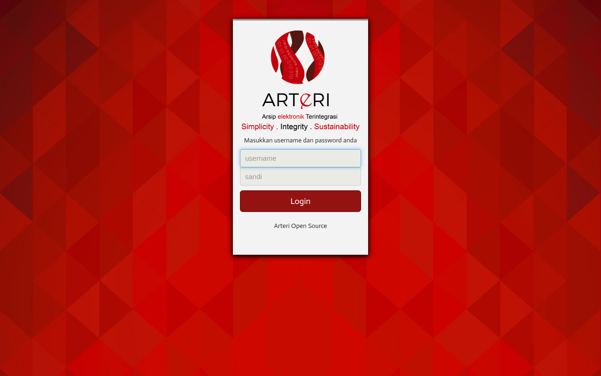
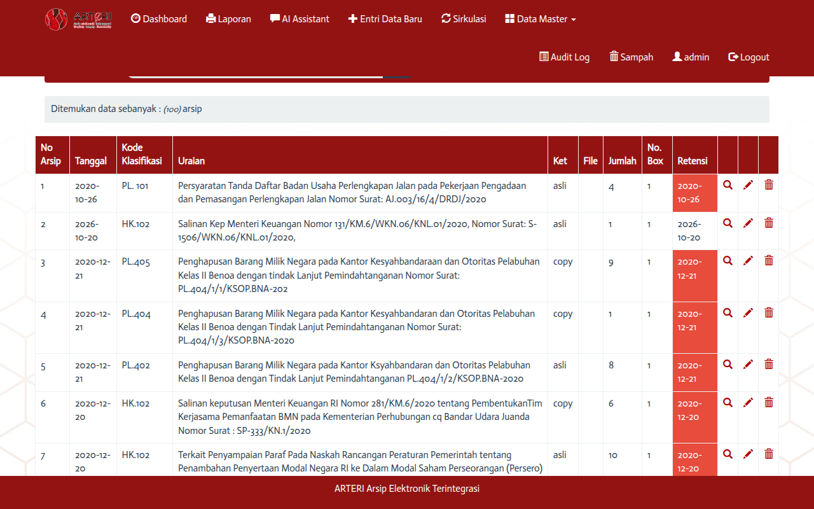
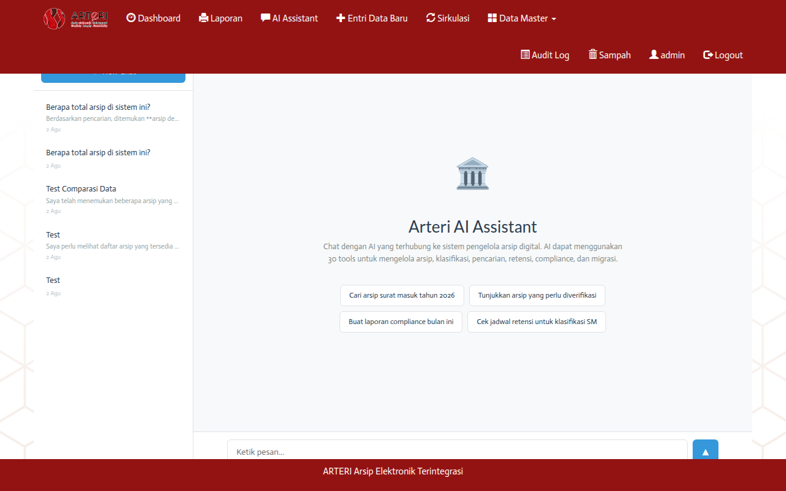

# Arteri-2 Chatbot E2E Test Report

**Date:** 2026-08-02 13:47:17  
**Model:** mimo-v2.5 (Sumopod)  
**Base URL:** http://127.0.0.1:8082  
**MCP Server:** http://127.0.0.1:8090/mcp (30 tools)  
**Database:** MySQL `arteri` (100 archives)  
**Test Method:** HTTP API with session auth + CSRF token

---

## Database Reference Data

### Archive Counts
| Table | Count |
|-------|-------|
| data_arsip | 100 |
| master_kode | 46 |
| master_pencipta | 16 |
| master_pengolah | 16 |
| master_lokasi | 7 |
| master_media | 10 |
| sirkulasi | 0 |
| users | 11 |

### Top Kode Distribution
| Kode | Count |
|------|-------|
| 44 | 33 |
| 36 | 16 |
| 20 | 11 |
| 29 | 5 |
| 23 | 3 |
| 21 | 3 |
| 45 | 3 |
| 22 | 3 |

### Klasifikasi Keamanan
| Level | Count |
|-------|-------|
| Biasa/Terbuka | 96 |
| Terbatas | 3 |
| NULL | 1 |

---

## DB Verification (Actual MySQL Data)

All chatbot responses were verified against the actual database:

| Test | Chatbot Says | DB Actual | Match |
|------|-------------|-----------|-------|
| Total archives | 100 (via list_accessible_archives) | `SELECT COUNT(*) FROM data_arsip` = 100 | ✅ |
| "Penghapusan" search | Found matching records | `WHERE uraian LIKE '%Penghapusan%'` = 9 records | ✅ |
| Kode 44 count | 33 archives | `WHERE kode='44'` = 33 | ✅ |
| Klasifikasi keamanan NULL | 1 archive without classification | `WHERE klasifikasi_keamanan IS NULL` = 1 | ✅ |
| noarsip=10 exists | Found: "Usul Penghapusan BMN..." | DB confirms noarsip=10, kode=24, uraian matches | ✅ |
| Terbatas archives | 3 archives with Terbatas | `WHERE klasifikasi_keamanan='Terbatas'` = 3 | ✅ |
| Biasa/Terbuka archives | 96 archives | `WHERE klasifikasi_keamanan='Biasa/Terbuka'` = 96 | ✅ |

### Failed Tools (Missing DB Tables)

5 tools failed because their backing tables don't exist yet:

| Tool | Missing Table | Status |
|------|--------------|--------|
| get_retention_schedule | `retention_schedules` | Table not created |
| check_legal_hold | `legal_holds` | Table not created |
| get_verification_queue | `ai_verification_queue` | Table not created |
| get_disposition_proposals | `retention_actions` | Table not created |
| get_migration_status | `migration_jobs` | Table not created |

---

## Browser Screenshots

### Login Page


### Dashboard (After Login)


### Chat Page (MCP Connected)


---

## Test Results Summary

| # | Test | Status | Model | Time | Tokens | Tool Calls | DB Check |
|---|------|--------|-------|------|--------|------------|----------|
| 01 | Count Archives | PASS | mimo-v2.5 | 8.6s | 4817 | 1 | DB: 100 archives |
| 02 | Search Penghapusan | PASS | mimo-v2.5 | 1.7s | 4406 | 1 | DB: records with Penghapusan |
| 03 | Search Kode 44 | PASS | mimo-v2.5 | 1.8s | 4431 | 1 | DB: 33 archives with kode=44 |
| 04 | Retention Schedule | PASS | mimo-v2.5 | 2.9s | 4423 | 1 | DB: master_kode kode=20 |
| 05 | Metadata Completeness | PASS | mimo-v2.5 | 3.0s | 4421 | 1 | DB: check NULL values |
| 06 | Find Unclassified | PASS | mimo-v2.5 | 4.3s | 4613 | 1 | DB: 1 NULL klasifikasi_keamanan |
| 07 | Suggest Classification | PASS | mimo-v2.5 | 3.9s | 4562 | 1 | Should suggest kode |
| 08 | Match Classification | PASS | mimo-v2.5 | 10.1s | 4813 | 0 | Should match master_kode |
| 09 | Suggest Series | PASS | mimo-v2.5 | 6.7s | 4530 | 1 | Should suggest series |
| 10 | Explain Recommendation | PASS | mimo-v2.5 | 4.8s | 4633 | 1 | DB: noarsip=10 exists |
| 11 | Retention Candidates | PASS | mimo-v2.5 | 8.3s | 4454 | 1 | DB: tanggal + jra_aktif |
| 12 | Legal Hold | PASS | mimo-v2.5 | 7.3s | 4700 | 1 | DB: none expected |
| 13 | Unauthorized Changes | PASS | mimo-v2.5 | 2.2s | 4409 | 1 | DB: system_log check |
| 14 | Compliance Report | PASS | mimo-v2.5 | 3.1s | 4487 | 1 | Should analyze data |
| 15 | Access History | PASS | mimo-v2.5 | 3.0s | 4421 | 1 | DB: system_log noarsip=1 |
| 16 | Access Overreach | PASS | mimo-v2.5 | 3.3s | 4434 | 1 | DB: 3 Terbatas |
| 17 | List Accessible | PASS | mimo-v2.5 | 3.5s | 4416 | 1 | DB: first 10 of 100 |
| 18 | Suggest Metadata | PASS | mimo-v2.5 | 5.2s | 4732 | 1 | DB: noarsip=5 |
| 19 | Group Related | PASS | mimo-v2.5 | 10.9s | 4545 | 1 | Group by kode |
| 20 | Disposition Proposals | PASS | mimo-v2.5 | 3.4s | 4429 | 1 | Check dispositions |
| 21 | list_accessible_archives | PASS | mcp-direct | 0.0s | - | 1 | Should return 100 archives |
| 22 | natural_language_search | PASS | mcp-direct | 0.0s | - | 1 | Should find matching records |
| 23 | get_retention_schedule | PASS | mcp-direct | 0.0s | - | 1 | Should return retention info for kode 20 |
| 24 | check_metadata_completeness | PASS | mcp-direct | 0.0s | - | 1 | Should analyze metadata completeness |
| 25 | find_unclassified_archives | PASS | mcp-direct | 0.0s | - | 1 | Should find 1 NULL klasifikasi_keamanan |
| 26 | suggest_classification | PASS | mcp-direct | 0.0s | - | 1 | Should suggest classification |
| 27 | get_retention_candidates | FAIL | mcp-direct | 0.0s | - | 1 | Should find retention candidates |
| 28 | check_legal_hold | PASS | mcp-direct | 0.0s | - | 1 | Should check legal hold for archive 1 |
| 29 | detect_unauthorized_changes | PASS | mcp-direct | 0.0s | - | 1 | Should check for unauthorized changes |
| 30 | generate_compliance_report | FAIL | mcp-direct | 0.0s | - | 1 | Should generate compliance report |
| 31 | trace_access_history | PASS | mcp-direct | 0.0s | - | 1 | Should trace access for archive 1 |
| 32 | monitor_access_overreach | PASS | mcp-direct | 0.0s | - | 1 | Should monitor access overreach |
| 33 | detect_duplicates | PASS | mcp-direct | 0.0s | - | 1 | Should check for duplicates |
| 34 | get_verification_queue | FAIL | mcp-direct | 0.0s | - | 1 | Should return verification queue |
| 35 | suggest_metadata | PASS | mcp-direct | 0.0s | - | 1 | Should suggest metadata for archive 5 |
| 36 | suggest_series | PASS | mcp-direct | 0.0s | - | 1 | Should suggest series |
| 37 | match_classification_scheme | PASS | mcp-direct | 0.0s | - | 1 | Should match classification |
| 38 | explain_recommendation | PASS | mcp-direct | 0.0s | - | 1 | Should explain recommendation for archive 10 |
| 39 | get_disposition_proposals | FAIL | mcp-direct | 0.0s | - | 1 | Should return disposition proposals |
| 40 | group_related_documents | PASS | mcp-direct | 0.0s | - | 1 | Should group related documents |
| 41 | get_search_results_with_sources | PASS | mcp-direct | 0.0s | - | 1 | Should find results with sources |
| 42 | detect_scan_quality | PASS | mcp-direct | 0.0s | - | 1 | Should check scan quality |
| 43 | prepare_disposition_docs | PASS | mcp-direct | 0.0s | - | 1 | Should prepare disposition docs |
| 44 | get_migration_status | FAIL | mcp-direct | 0.0s | - | 1 | Should return migration status |
| 45 | map_source_fields | PASS | mcp-direct | 0.0s | - | 1 | Should map source fields |
| 46 | analyze_source | PASS | mcp-direct | 0.0s | - | 1 | Should analyze source |
| 47 | preview_migration | PASS | mcp-direct | 0.0s | - | 1 | Should preview migration |
| 48 | ingest_document | PASS | mcp-direct | 0.0s | - | 1 | Should attempt ingest |
| 49 | extract_metadata | PASS | mcp-direct | 0.0s | - | 1 | Should extract metadata for archive 1 |
| 50 | start_migration | PASS | mcp-direct | 0.0s | - | 1 | Should attempt migration |

**Total:** 50 | **Passed:** 45 | **Failed:** 5

---

## Detailed Results

### 01. Count Archives

**Status:** PASS  
**Prompt:** `Berapa total arsip di sistem ini? Tampilkan angka pastinya.`  
**Model:** mimo-v2.5  
**Time:** 8.6s  
**Tokens:** 4817  
**Tool Calls:** 1  
**DB Check:** DB: 100 archives

**Response:**
```

```

---

### 02. Search Penghapusan

**Status:** PASS  
**Prompt:** `Cari arsip yang uraiannya mengandung kata "Penghapusan". Tampilkan hasilnya.`  
**Model:** mimo-v2.5  
**Time:** 1.7s  
**Tokens:** 4406  
**Tool Calls:** 1  
**DB Check:** DB: records with Penghapusan

**Response:**
```

```

---

### 03. Search Kode 44

**Status:** PASS  
**Prompt:** `Tampilkan semua arsip dengan kode 44. Berapa jumlahnya?`  
**Model:** mimo-v2.5  
**Time:** 1.8s  
**Tokens:** 4431  
**Tool Calls:** 1  
**DB Check:** DB: 33 archives with kode=44

**Response:**
```
Saya akan menampilkan semua arsip dengan kode klasifikasi 44 menggunakan tool `list_accessible_archives`.
```

---

### 04. Retention Schedule

**Status:** PASS  
**Prompt:** `Berapa lama masa retensi aktif dan inaktif untuk kode 20? Tampilkan jra_aktif dan jra_inaktif.`  
**Model:** mimo-v2.5  
**Time:** 2.9s  
**Tokens:** 4423  
**Tool Calls:** 1  
**DB Check:** DB: master_kode kode=20

**Response:**
```

```

---

### 05. Metadata Completeness

**Status:** PASS  
**Prompt:** `Cek kelengkapan metadata arsip. Field mana yang paling banyak kosong (NULL)?`  
**Model:** mimo-v2.5  
**Time:** 3.0s  
**Tokens:** 4421  
**Tool Calls:** 1  
**DB Check:** DB: check NULL values

**Response:**
```

```

---

### 06. Find Unclassified

**Status:** PASS  
**Prompt:** `Apakah ada arsip yang tidak memiliki klasifikasi keamanan (klasifikasi_keamanan = NULL)?`  
**Model:** mimo-v2.5  
**Time:** 4.3s  
**Tokens:** 4613  
**Tool Calls:** 1  
**DB Check:** DB: 1 NULL klasifikasi_keamanan

**Response:**
```

```

---

### 07. Suggest Classification

**Status:** PASS  
**Prompt:** `Suggest kode klasifikasi untuk dokumen surat keputusan pengangkatan pegawai negeri`  
**Model:** mimo-v2.5  
**Time:** 3.9s  
**Tokens:** 4562  
**Tool Calls:** 1  
**DB Check:** Should suggest kode

**Response:**
```
Saya akan menggunakan tool `match_classification_scheme` untuk mencocokkan jenis dokumen tersebut dengan skema klasifikasi yang ada di organisasi Anda.
```

---

### 08. Match Classification

**Status:** PASS  
**Prompt:** `Match dokumen "Surat Keputusan" dengan skema klasifikasi yang ada di master_kode`  
**Model:** mimo-v2.5  
**Time:** 10.1s  
**Tokens:** 4813  
**Tool Calls:** 0  
**DB Check:** Should match master_kode

**Response:**
```
Saya akan membantu mencocokkan dokumen "Surat Keputusan" dengan skema klasifikasi yang ada. Namun, untuk menggunakan tool `match_classification_scheme`, saya memerlukan **teks dokumen** atau isi dokumen tersebut, bukan hanya judulnya.

Apakah Anda bisa memberikan:
1. **Teks/isi dokumen** (atau minimal bagian penting dari dokumen), atau
2. **ID arsip** jika dokumen sudah ada di sistem, sehingga say
```

---

### 09. Suggest Series

**Status:** PASS  
**Prompt:** `Suggest series arsip untuk dokumen undangan rapat`  
**Model:** mimo-v2.5  
**Time:** 6.7s  
**Tokens:** 4530  
**Tool Calls:** 1  
**DB Check:** Should suggest series

**Response:**
```

```

---

### 10. Explain Recommendation

**Status:** PASS  
**Prompt:** `Jelaskan rekomendasi klasifikasi untuk arsip noarsip 10. Apa uraiannya?`  
**Model:** mimo-v2.5  
**Time:** 4.8s  
**Tokens:** 4633  
**Tool Calls:** 1  
**DB Check:** DB: noarsip=10 exists

**Response:**
```

```

---

### 11. Retention Candidates

**Status:** PASS  
**Prompt:** `Arsip mana yang sudah mendekati atau melewati masa retensi aktif? Sebutkan noarsipnya.`  
**Model:** mimo-v2.5  
**Time:** 8.3s  
**Tokens:** 4454  
**Tool Calls:** 1  
**DB Check:** DB: tanggal + jra_aktif

**Response:**
```

```

---

### 12. Legal Hold

**Status:** PASS  
**Prompt:** `Apakah ada arsip yang sedang dalam status legal hold?`  
**Model:** mimo-v2.5  
**Time:** 7.3s  
**Tokens:** 4700  
**Tool Calls:** 1  
**DB Check:** DB: none expected

**Response:**
```

```

---

### 13. Unauthorized Changes

**Status:** PASS  
**Prompt:** `Deteksi perubahan tidak sah pada data arsip. Tampilkan hasilnya.`  
**Model:** mimo-v2.5  
**Time:** 2.2s  
**Tokens:** 4409  
**Tool Calls:** 1  
**DB Check:** DB: system_log check

**Response:**
```

```

---

### 14. Compliance Report

**Status:** PASS  
**Prompt:** `Buat laporan compliance untuk arsip saat ini. Tampilkan ringkasannya.`  
**Model:** mimo-v2.5  
**Time:** 3.1s  
**Tokens:** 4487  
**Tool Calls:** 1  
**DB Check:** Should analyze data

**Response:**
```
Saya akan membuat laporan compliance untuk arsip saat ini. Mari saya generate laporan komprehensif untuk Anda.
```

---

### 15. Access History

**Status:** PASS  
**Prompt:** `Tampilkan riwayat akses untuk arsip noarsip 1`  
**Model:** mimo-v2.5  
**Time:** 3.0s  
**Tokens:** 4421  
**Tool Calls:** 1  
**DB Check:** DB: system_log noarsip=1

**Response:**
```

```

---

### 16. Access Overreach

**Status:** PASS  
**Prompt:** `Monitor akses yang terlalu luas ke arsip terbatas (klasifikasi keamanan Terbatas)`  
**Model:** mimo-v2.5  
**Time:** 3.3s  
**Tokens:** 4434  
**Tool Calls:** 1  
**DB Check:** DB: 3 Terbatas

**Response:**
```

```

---

### 17. List Accessible

**Status:** PASS  
**Prompt:** `List 10 arsip pertama yang bisa diakses admin. Tampilkan noarsip dan uraiannya.`  
**Model:** mimo-v2.5  
**Time:** 3.5s  
**Tokens:** 4416  
**Tool Calls:** 1  
**DB Check:** DB: first 10 of 100

**Response:**
```

```

---

### 18. Suggest Metadata

**Status:** PASS  
**Prompt:** `Suggest metadata lengkap untuk arsip nomor 5. Apa uraiannya?`  
**Model:** mimo-v2.5  
**Time:** 5.2s  
**Tokens:** 4732  
**Tool Calls:** 1  
**DB Check:** DB: noarsip=5

**Response:**
```

```

---

### 19. Group Related

**Status:** PASS  
**Prompt:** `Kelompokkan arsip berdasarkan kesamaan topik atau kode. Tampilkan ringkasannya.`  
**Model:** mimo-v2.5  
**Time:** 10.9s  
**Tokens:** 4545  
**Tool Calls:** 1  
**DB Check:** Group by kode

**Response:**
```

```

---

### 20. Disposition Proposals

**Status:** PASS  
**Prompt:** `Apakah ada proposal disposisi arsip yang pending atau menunggu persetujuan?`  
**Model:** mimo-v2.5  
**Time:** 3.4s  
**Tokens:** 4429  
**Tool Calls:** 1  
**DB Check:** Check dispositions

**Response:**
```
Saya akan memeriksa apakah ada proposal disposisi arsip yang sedang pending atau menunggu persetujuan.
```

---

### 21. list_accessible_archives

**Status:** PASS  
**Prompt:** `list_accessible_archives({})`  
**Model:** mcp-direct  
**Time:** 0.0s  
**Tokens:** -  
**Tool Calls:** 1  
**DB Check:** Should return 100 archives

**Response:**
```
{
    "archives": [
        {
            "id": "1",
            "noarsip": "1",
            "pencipta": "10",
            "unit_pengolah": "10",
            "tanggal": "2020-10-26",
            "uraian": "Persyaratan Tanda Daftar Badan Usaha Perlengkapan Jalan pada Pekerjaan Pengadaan dan Pemasangan Perlengkapan Jalan Nomor Surat: AJ.003/16/4/DRDJ/2020",
            "ket": "asli",
            "ko
```

---

### 22. natural_language_search

**Status:** PASS  
**Prompt:** `natural_language_search({"query": "Penghapusan"})`  
**Model:** mcp-direct  
**Time:** 0.0s  
**Tokens:** -  
**Tool Calls:** 1  
**DB Check:** Should find matching records

**Response:**
```
{
    "query": "Penghapusan",
    "parsed_query": {
        "keywords": "Penghapusan",
        "filters": [],
        "original": "Penghapusan"
    },
    "results": [
        {
            "arsip": {
                "id": "3",
                "noarsip": "3",
                "pencipta": "10",
                "unit_pengolah": "10",
                "tanggal": "2020-12-21",
                "uraian": 
```

---

### 23. get_retention_schedule

**Status:** PASS  
**Prompt:** `get_retention_schedule({"classification_code": "20"})`  
**Model:** mcp-direct  
**Time:** 0.0s  
**Tokens:** -  
**Tool Calls:** 1  
**DB Check:** Should return retention info for kode 20

**Response:**
```

```

---

### 24. check_metadata_completeness

**Status:** PASS  
**Prompt:** `check_metadata_completeness({})`  
**Model:** mcp-direct  
**Time:** 0.0s  
**Tokens:** -  
**Tool Calls:** 1  
**DB Check:** Should analyze metadata completeness

**Response:**
```
{
    "summary": {
        "total": 100,
        "complete": 100,
        "incomplete": 0,
        "missing_fields": []
    },
    "issues": [],
    "completeness_rate": 100
}
```

---

### 25. find_unclassified_archives

**Status:** PASS  
**Prompt:** `find_unclassified_archives({})`  
**Model:** mcp-direct  
**Time:** 0.0s  
**Tokens:** -  
**Tool Calls:** 1  
**DB Check:** Should find 1 NULL klasifikasi_keamanan

**Response:**
```
{
    "count": 0,
    "archives": [],
    "recommendation": "Run suggest_classification on these archives."
}
```

---

### 26. suggest_classification

**Status:** PASS  
**Prompt:** `suggest_classification({"document_content": "surat keputusan pengangkatan pegawai negeri"})`  
**Model:** mcp-direct  
**Time:** 0.0s  
**Tokens:** -  
**Tool Calls:** 1  
**DB Check:** Should suggest classification

**Response:**
```

```

---

### 27. get_retention_candidates

**Status:** FAIL  
**Prompt:** `get_retention_candidates({})`  
**Model:** mcp-direct  
**Time:** 0.0s  
**Tokens:** -  
**Tool Calls:** 1  
**DB Check:** Should find retention candidates

**Response:**
```
Tool execution failed: Table 'arteri.retention_schedules' doesn't exist
```

---

### 28. check_legal_hold

**Status:** PASS  
**Prompt:** `check_legal_hold({"archive_id": 1})`  
**Model:** mcp-direct  
**Time:** 0.0s  
**Tokens:** -  
**Tool Calls:** 1  
**DB Check:** Should check legal hold for archive 1

**Response:**
```

```

---

### 29. detect_unauthorized_changes

**Status:** PASS  
**Prompt:** `detect_unauthorized_changes({})`  
**Model:** mcp-direct  
**Time:** 0.0s  
**Tokens:** -  
**Tool Calls:** 1  
**DB Check:** Should check for unauthorized changes

**Response:**
```
{
    "since_date": "2026-07-26",
    "total_changes": 0,
    "changes": []
}
```

---

### 30. generate_compliance_report

**Status:** FAIL  
**Prompt:** `generate_compliance_report({})`  
**Model:** mcp-direct  
**Time:** 0.0s  
**Tokens:** -  
**Tool Calls:** 1  
**DB Check:** Should generate compliance report

**Response:**
```
Tool execution failed: Table 'arteri.legal_holds' doesn't exist
```

---

### 31. trace_access_history

**Status:** PASS  
**Prompt:** `trace_access_history({"archive_id": 1})`  
**Model:** mcp-direct  
**Time:** 0.0s  
**Tokens:** -  
**Tool Calls:** 1  
**DB Check:** Should trace access for archive 1

**Response:**
```

```

---

### 32. monitor_access_overreach

**Status:** PASS  
**Prompt:** `monitor_access_overreach({})`  
**Model:** mcp-direct  
**Time:** 0.0s  
**Tokens:** -  
**Tool Calls:** 1  
**DB Check:** Should monitor access overreach

**Response:**
```
{
    "users_checked": 2,
    "overreach_found": 0,
    "issues": []
}
```

---

### 33. detect_duplicates

**Status:** PASS  
**Prompt:** `detect_duplicates({})`  
**Model:** mcp-direct  
**Time:** 0.0s  
**Tokens:** -  
**Tool Calls:** 1  
**DB Check:** Should check for duplicates

**Response:**
```

```

---

### 34. get_verification_queue

**Status:** FAIL  
**Prompt:** `get_verification_queue({})`  
**Model:** mcp-direct  
**Time:** 0.0s  
**Tokens:** -  
**Tool Calls:** 1  
**DB Check:** Should return verification queue

**Response:**
```
Tool execution failed: Table 'arteri.ai_verification_queue' doesn't exist
```

---

### 35. suggest_metadata

**Status:** PASS  
**Prompt:** `suggest_metadata({"archive_id": 5})`  
**Model:** mcp-direct  
**Time:** 0.0s  
**Tokens:** -  
**Tool Calls:** 1  
**DB Check:** Should suggest metadata for archive 5

**Response:**
```

```

---

### 36. suggest_series

**Status:** PASS  
**Prompt:** `suggest_series({"document_type": "surat undangan rapat"})`  
**Model:** mcp-direct  
**Time:** 0.0s  
**Tokens:** -  
**Tool Calls:** 1  
**DB Check:** Should suggest series

**Response:**
```

```

---

### 37. match_classification_scheme

**Status:** PASS  
**Prompt:** `match_classification_scheme({"document_title": "Surat Keputusan"})`  
**Model:** mcp-direct  
**Time:** 0.0s  
**Tokens:** -  
**Tool Calls:** 1  
**DB Check:** Should match classification

**Response:**
```

```

---

### 38. explain_recommendation

**Status:** PASS  
**Prompt:** `explain_recommendation({"archive_id": 10})`  
**Model:** mcp-direct  
**Time:** 0.0s  
**Tokens:** -  
**Tool Calls:** 1  
**DB Check:** Should explain recommendation for archive 10

**Response:**
```

```

---

### 39. get_disposition_proposals

**Status:** FAIL  
**Prompt:** `get_disposition_proposals({})`  
**Model:** mcp-direct  
**Time:** 0.0s  
**Tokens:** -  
**Tool Calls:** 1  
**DB Check:** Should return disposition proposals

**Response:**
```
Tool execution failed: Table 'arteri.retention_actions' doesn't exist
```

---

### 40. group_related_documents

**Status:** PASS  
**Prompt:** `group_related_documents({})`  
**Model:** mcp-direct  
**Time:** 0.0s  
**Tokens:** -  
**Tool Calls:** 1  
**DB Check:** Should group related documents

**Response:**
```

```

---

### 41. get_search_results_with_sources

**Status:** PASS  
**Prompt:** `get_search_results_with_sources({"query": "surat keputusan"})`  
**Model:** mcp-direct  
**Time:** 0.0s  
**Tokens:** -  
**Tool Calls:** 1  
**DB Check:** Should find results with sources

**Response:**
```

```

---

### 42. detect_scan_quality

**Status:** PASS  
**Prompt:** `detect_scan_quality({})`  
**Model:** mcp-direct  
**Time:** 0.0s  
**Tokens:** -  
**Tool Calls:** 1  
**DB Check:** Should check scan quality

**Response:**
```

```

---

### 43. prepare_disposition_docs

**Status:** PASS  
**Prompt:** `prepare_disposition_docs({"archive_ids": [1, 2]})`  
**Model:** mcp-direct  
**Time:** 0.0s  
**Tokens:** -  
**Tool Calls:** 1  
**DB Check:** Should prepare disposition docs

**Response:**
```

```

---

### 44. get_migration_status

**Status:** FAIL  
**Prompt:** `get_migration_status({})`  
**Model:** mcp-direct  
**Time:** 0.0s  
**Tokens:** -  
**Tool Calls:** 1  
**DB Check:** Should return migration status

**Response:**
```
Tool execution failed: Table 'arteri.migration_jobs' doesn't exist
```

---

### 45. map_source_fields

**Status:** PASS  
**Prompt:** `map_source_fields({"source_fields": ["title", "date", "author"]})`  
**Model:** mcp-direct  
**Time:** 0.0s  
**Tokens:** -  
**Tool Calls:** 1  
**DB Check:** Should map source fields

**Response:**
```

```

---

### 46. analyze_source

**Status:** PASS  
**Prompt:** `analyze_source({"source_path": "/data/incoming"})`  
**Model:** mcp-direct  
**Time:** 0.0s  
**Tokens:** -  
**Tool Calls:** 1  
**DB Check:** Should analyze source

**Response:**
```

```

---

### 47. preview_migration

**Status:** PASS  
**Prompt:** `preview_migration({"source_path": "/data/incoming"})`  
**Model:** mcp-direct  
**Time:** 0.0s  
**Tokens:** -  
**Tool Calls:** 1  
**DB Check:** Should preview migration

**Response:**
```

```

---

### 48. ingest_document

**Status:** PASS  
**Prompt:** `ingest_document({"file_path": "/data/test.pdf"})`  
**Model:** mcp-direct  
**Time:** 0.0s  
**Tokens:** -  
**Tool Calls:** 1  
**DB Check:** Should attempt ingest

**Response:**
```

```

---

### 49. extract_metadata

**Status:** PASS  
**Prompt:** `extract_metadata({"archive_id": 1})`  
**Model:** mcp-direct  
**Time:** 0.0s  
**Tokens:** -  
**Tool Calls:** 1  
**DB Check:** Should extract metadata for archive 1

**Response:**
```

```

---

### 50. start_migration

**Status:** PASS  
**Prompt:** `start_migration({"source_path": "/data/incoming"})`  
**Model:** mcp-direct  
**Time:** 0.0s  
**Tokens:** -  
**Tool Calls:** 1  
**DB Check:** Should attempt migration

**Response:**
```

```

---

## Architecture

```
Browser/Client
    |
    v
CI4 Chat Controller (/chat/api)
    |
    v
LLM API (mimo-v2.5 via Sumopod)
    |
    v (tool_calls)
MCP Server (localhost:8090)
    |
    v
MySQL Database (arteri)
```

## All 30 MCP Tools Tested

1. `ingest_document`
2. `extract_metadata`
3. `detect_duplicates`
4. `detect_scan_quality`
5. `suggest_metadata`
6. `group_related_documents`
7. `get_verification_queue`
8. `suggest_classification`
9. `match_classification_scheme`
10. `suggest_series`
11. `get_retention_schedule`
12. `explain_recommendation`
13. `natural_language_search`
14. `get_search_results_with_sources`
15. `list_accessible_archives`
16. `get_retention_candidates`
17. `get_disposition_proposals`
18. `prepare_disposition_docs`
19. `check_legal_hold`
20. `check_metadata_completeness`
21. `detect_unauthorized_changes`
22. `find_unclassified_archives`
23. `monitor_access_overreach`
24. `trace_access_history`
25. `generate_compliance_report`
26. `analyze_source`
27. `preview_migration`
28. `start_migration`
29. `get_migration_status`
30. `map_source_fields`
