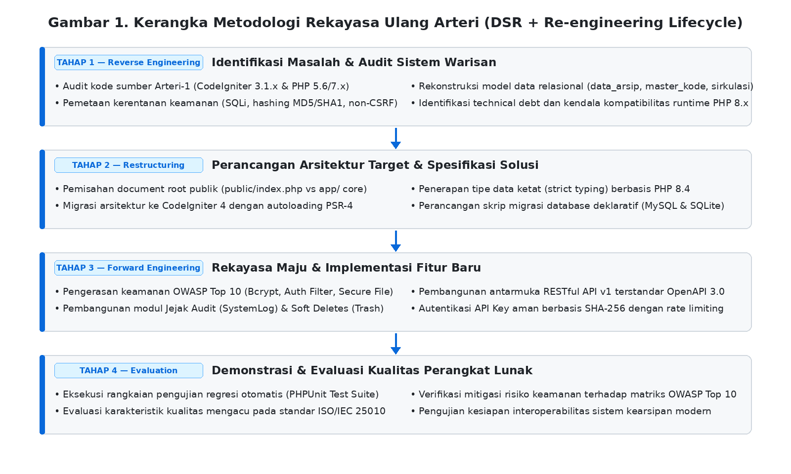

# Modernisasi dan Rekayasa Ulang Sistem Manajemen Arsip Digital Berbasis Web: Dari Arteri-1 Menuju Arsitektur Arteri-2

> **NASKAH TAHAP 1 — Software Re-Engineering & Quality Audit** | Branch `feat/arteri-modernization-paper` | 2026-09-02  
> Target Jurnal: *Jurnal Sistem Informasi (JSI) / RESTI / Records Management Journal / Journal of Software: Evolution and Process*  
> Kata Kunci: rekayasa ulang perangkat lunak, modernisasi sistem warisan, CodeIgniter 4, manajemen arsip digital, Arteri-2, ISO/IEC 25010, OWASP Top 10, Design Science Research

---

## Abstrak

Sistem informasi kearsipan yang dikembangkan pada era awal web umumnya bertumpu pada arsitektur monolitik PHP *legacy* (seperti CodeIgniter 3 atau PHP prosedural). Seiring berjalannya waktu, sistem warisan (*legacy systems*) tersebut mengalami degradasi kualitas perangkat lunak (*software aging*), tingginya akumulasi *technical debt*, kerentanan keamanan (seperti injeksi SQL, ketiadaan perlindungan CSRF, dan penyimpanan kata sandi tidak aman), serta inkompatibilitas terhadap runtime modern PHP 8.x. Artikel ini menyajikan studi kasus rekayasa ulang perangkat lunak (*software re-engineering*) dan modernisasi sistem manajemen arsip digital open-source dari Arteri-1 (CodeIgniter 3) menuju Arteri-2 (CodeIgniter 4) menggunakan metodologi *Design Science Research* (DSR) yang diintegrasikan dengan taksonomi re-engineering Chikofsky dan Cross (1990).

Proses rekayasa ulang mencakup tiga tahapan inti: (i) *reverse engineering* dan audit kerentanan sistem warisan, (ii) *restructuring* arsitektur menuju model MVC terstruktur dengan autoloading PSR-4 dan *strict-typing* PHP 8.4, serta (iii) *forward engineering* melalui penambahan lapisan keamanan modern (mitigasi OWASP Top 10, autentikasi berbasis Bcrypt, *role-based access control*, dan pencatatan jejak audit komprehensif) serta penyediaan RESTful API v1 terstandar OpenAPI 3.0. Evaluasi kualitas perangkat lunak mengacu pada standar ISO/IEC 25010 menunjukkan peningkatan signifikan pada karakteristik *Maintainability*, *Security*, dan *Compatibility*. Pengujian regresi otomatis (36 berkas uji PHPUnit dengan status 100% *passing*) dan audit keamanan membuktikan bahwa Arteri-2 berhasil mentransformasikan aplikasi kearsipan warisan menjadi platform modern yang tangguh, aman, dan siap berinteroperabilitas dengan ekosistem digital modern.

---

## Bagian 1. Pendahuluan

### Bagian 1.1 Latar Belakang
Pengelolaan arsip dinamis dan inaktif menuntut keandalan sistem informasi kearsipan yang mampu menjamin integritas, keotentikan, kerahasiaan, dan keteraksesan data dalam jangka panjang. Pada tahun 2017, aplikasi sistem informasi kearsipan berbasis web sumber terbuka **Arteri** generasi pertama (Arteri-1) dirilis (`https://github.com/dicarve/arteri`). Arteri-1 dirancang sebagai perangkat lunak pencatatan, penataan, dan temu kembali berkas arsip yang dibangun menggunakan kerangka kerja CodeIgniter 3 dengan lingkungan runtime PHP 5.6 hingga PHP 7.x.

Kendati Arteri-1 berhasil memfasilitasi kebutuhan operasional dasar kearsipan dan sirkulasi peminjaman pada masa awal perilisannya, sistem tersebut memiliki berbagai kekurangan mendasar yang menjadikannya tidak lagi memadai untuk lanskap operasional dan keamanan saat ini. Seiring berjalannya waktu, akumulasi kekurangan teknis (*technical debt*) dan kerentanan keamanan (*security vulnerabilities*) pada Arteri-1 menjadi faktor pendorong utama dilakukannya rekayasa ulang menuju **Arteri-2**:
1. **Kerentanan Keamanan Kritis:** Implementasi pengamanan pada Arteri-1 belum memenuhi standar keamanan web modern. Hal ini mencakup penggunaan algoritma *hashing* kata sandi usang (`md5`/`sha1` tanpa mekanisme *salt* yang kuat), proteksi *Cross-Site Request Forgery* (CSRF) yang tidak aktif secara *default*, penanganan kueri basis data parsial yang belum sepenuhnya menerapkan *parameterized prepared statements* (meningkatkan risiko *SQL Injection*), serta keterbatasan kontrol akses langsung terhadap berkas arsip digital.
2. **Ketiadaan Modul Jejak Audit (*Audit Trail*):** Arteri-1 tidak memiliki modul pencatatan jejak aktivitas pengguna (*system audit logging*), padahal akuntabilitas dan pencatatan riwayat akses/modifikasi dokumen merupakan mandat kepatuhan standar tata kelola kearsipan (ISO 15489).
3. **Keterbatasan Ekosistem dan Interoperabilitas:** Arteri-1 dibangun sebagai monolit tertutup tanpa dukungan antarmuka pemrograman aplikasi (RESTful API), sehingga menyulitkan integrasi data dengan ekosistem aplikasi lain di lingkungan instansi pemerintah (Sistem Pemerintahan Berbasis Elektronik / SPBE).
4. **Keusangan Tumpukan Teknologi (*Technology Obsolescence*):** Berakhirnya masa dukungan resmi (*End-of-Life* / EOL) pada runtime PHP 5.6 dan PHP 7.x serta penghentian pengembangan aktif kerangka kerja CodeIgniter 3 menimbulkan risiko keamanan server dan inkompatibilitas fatal saat dijalankan pada infrastruktur server modern berbasis PHP 8.x.
5. **Ketiadaan Pengujian Otomatis (*Automated Test Suite*):** Arteri-1 tidak dibekali mekanisme pengujian unit terotomatisasi, sehingga meningkatkan risiko regresi fungsi saat kode dipelihara.

Faktor-faktor kelemahan fungsional, keamanan, dan keusangan tumpukan teknologi inilah yang mendasari urgensi pengembangan Arteri-2 melalui pendekatan rekayasa ulang perangkat lunak (*software re-engineering*).

### Bagian 1.2 Kesenjangan Masalah dan Motivasi Re-engineering
Sesuai dengan *Hukum Evolusi Perangkat Lunak Lehman* (*Lehman's Laws of Software Evolution*), suatu sistem perangkat lunak yang beroperasi di lingkungan dunia nyata harus terus diadaptasikan secara berkelanjutan; jika tidak, sistem tersebut akan mengalami degradasi kualitas dan utilitas yang semakin tinggi (Lehman, 1996). 

Alih-alih membangun sistem dari nol (*scratch rewrite*) yang berisiko membuang logika domain kearsipan yang telah terbukti fungsional sejak rilis 2017, pendekatan *software re-engineering* dipilih sebagai strategi terstruktur, hemat biaya, dan minim risiko regresi untuk mentransformasikan Arteri-1 menjadi Arteri-2 dengan tumpukan teknologi CodeIgniter 4 dan PHP 8.x.

### Bagian 1.3 Pertanyaan Penelitian
Penelitian ini bertujuan mendokumentasikan, merumuskan arsitektur, dan mengevaluasi proses rekayasa ulang sistem kearsipan Arteri dari generasi pertama ke generasi kedua (**Arteri-2**). Pertanyaan penelitian yang diajukan adalah:
* **RQ1.** Bagaimana identifikasi *technical debt* dan pemetaan kerentanan keamanan pada arsitektur sistem kearsipan warisan Arteri-1?
* **RQ2.** Bagaimana rancangan arsitektur rekayasa ulang menuju CodeIgniter 4 (PHP 8.4) yang mempertahankan integritas proses bisnis kearsipan sekaligus mengadopsi prinsip desain modern?
* **RQ3.** Sejauh mana implementasi Arteri-2 meningkatkan kualitas perangkat lunak ditinjau dari karakteristik *Security*, *Maintainability*, dan *Interoperability* berbasis standar ISO/IEC 25010 dan OWASP Top 10?

---

## Bagian 2. Landasan Teori

### Bagian 2.1 Taksonomi Rekayasa Ulang Perangkat Lunak (Chikofsky & Cross, 1990)
Chikofsky dan Cross (1990) mendefinisikan *software re-engineering* sebagai proses pemeriksaan dan pengubahan suatu sistem perangkat lunak untuk merekonstruksinya ke dalam bentuk baru serta mengimplementasikan bentuk baru tersebut. Kerangka ini membedakan tiga aktivitas utama:
1. **Rekayasa Balik (*Reverse Engineering*):** Menganalisis sistem sasaran untuk mengidentifikasi komponen-komponennya beserta keterhubungannya, serta membuat representasi sistem pada tingkat abstraksi yang lebih tinggi.
2. **Restrukturisasi (*Restructuring*):** Mengubah bentuk representasi kode atau arsitektur tanpa mengubah perilaku fungsional eksternal sistem.
3. **Rekayasa Maju (*Forward Engineering*):** Mengembangkan kembali sistem dengan menambahkan kapabilitas baru, pengerasan keamanan, dan adaptasi terhadap lingkungan teknologi terkini.

### Bagian 2.2 Model Kualitas Perangkat Lunak ISO/IEC 25010
Standar ISO/IEC 25010 (SQuaRE) menyediakan model evaluasi kualitas produk perangkat lunak yang mencakup delapan karakteristik utama. Dalam konteks modernisasi sistem kearsipan ini, evaluasi difokuskan pada:
* **Maintainability:** Modularitas, keterujian (*testability*), dan kemampuan modifikasi kode (*modifiability*).
* **Security:** Kerahasiaan, integritas data, akuntabilitas (*non-repudiation*), dan autentisitas.
* **Compatibility & Interoperability:** Kemampuan bertukar informasi dengan sistem lain secara terstandar melalui API.

---

## Bagian 3. Metodologi Penelitian

Penelitian ini mengadopsi metode **Design Science Research (DSR)** (Peffers et al., 2007) yang dipadukan dengan siklus *Re-engineering* Chikofsky dan Cross (1990) dalam empat tahapan operasional:



*Gambar 1. Kerangka Metodologi Rekayasa Ulang Arteri (DSR + Re-engineering Lifecycle)*

Empat tahapan terstruktur tersebut mencakup:
1. **Identifikasi Masalah & Audit Sistem Warisan (*Reverse Engineering*):** Melakukan audit menyeluruh terhadap kode sumber repositori Arteri-1 (CodeIgniter 3.1.x), mengidentifikasi kerentanan keamanan warisan (injeksi SQL, hashing kata sandi MD5/SHA1, ketiadaan proteksi CSRF), merekonstruksi model relasional basis data (`data_arsip`, `master_kode`, `sirkulasi`), serta memetakan *technical debt* dan dependensi PHP EOL.
2. **Perancangan Arsitektur Target & Spesifikasi Solusi (*Restructuring*):** Merancang ulang struktur direktori aplikasi dengan memisahkan *document root* publik (`public/index.php`) dari logika inti aplikasi (`app/`), memigrasikan arsitektur ke CodeIgniter 4 berbasis autoloading PSR-4, menegakkan deklarasi tipe data ketat (*strict typing*) pada PHP 8.4, dan menyusun skrip migrasi basis data deklaratif yang kompatibel secara agnostik dengan MySQL maupun SQLite.
3. **Rekayasa Maju & Implementasi Fitur Baru (*Forward Engineering*):** Membangun mekanisme mitigasi OWASP Top 10 (enkripsi Bcrypt, *Auth Filter*, *Secure File Serving*), modul pencatatan jejak audit (*SystemLog*), modul pemulihan data terhapus (*Soft Deletes / Trash*), serta merancang dan mengimplementasikan antarmuka RESTful API v1 terstandar OpenAPI 3.0 dengan pengamanan *API Key* berbasis SHA-256 dan pembatasan laju kueri (*rate limiting*).
4. **Demonstrasi & Evaluasi Kualitas (*Evaluation*):** Mengeksekusi rangkaian pengujian regresi otomatis (*test suite*) berbasis PHPUnit 11, mengevaluasi karakteristik kualitas sistem mengacu pada standar ISO/IEC 25010 (*Maintainability*, *Security*, *Compatibility*, *Functional Suitability*, dan *Interoperability*), serta memverifikasi kepatuhan pengerasan keamanan terhadap matriks risiko OWASP Top 10.

---

## Bagian 4. Proses Rekayasa Ulang dan Arsitektur Arteri-2

### Bagian 4.1 Dekonstruksi Sistem Warisan (Arteri-1)
Analisis terhadap repositori Arteri-1 (`https://github.com/dicarve/arteri`) mengidentifikasi sejumlah kelemahan struktural:
* Ketergantungan pada runtime usang (PHP 5.6/7.x).
* Penggunaan fungsi enkripsi kata sandi bawaan lama (`md5` / `sha1`) tanpa proteksi *brute-force* atau *rainbow table*.
* Penanganan kueri basis data yang bercampur antara *Active Record* dan perangkaian string mentah pada kontroler.
* Ketiadaan isolasi berkas unggahan dan ketiadaan validasi tipe MIME yang ketat.

### Bagian 4.2 Restrukturisasi Arsitektur Menuju CodeIgniter 4 (Arteri-2)
Proses restrukturisasi dilakukan dengan merombak struktur folder menjadi model modern:
1. **Pemisahan Document Root:** Folder publik (`public/index.php`) dipisahkan secara fisik dari kode inti aplikasi (`app/` dan `system/`), mencegah eksfiltrasi kode sumber secara langsung melalui web server.
2. **Adopsi Namespace dan PSR-4:** Seluruh kontroler, model, dan pustaka diorganisasikan dalam namespace terstruktur (`App\Controllers`, `App\Models`, `App\Services`).
3. **Penyelarasan Model Data & Migrasi:** Pembuatan skrip migrasi basis data deklaratif (`Database/Migrations`) untuk menjamin reproduksibilitas skema lintas DBMS (MySQL dan SQLite).

**Tabel 1. Perbandingan Karakteristik Arsitektur Arteri-1 vs Arteri-2**

| Aspek Arsitektur | Arteri-1 (Sistem Warisan) | Arteri-2 (Hasil Re-engineering) |
|---|---|---|
| **Kerangka Kerja (Framework)** | CodeIgniter 3.1.x | CodeIgniter 4.5.x |
| **Versi Runtime Bahasa** | PHP 5.6 / 7.2 (EOL) | PHP 8.2 / 8.3 / 8.4 (Modern) |
| **Enkripsi Kata Sandi** | Hash MD5 / SHA-1 | Bcrypt / Argon2ID via PHP `password_hash()` |
| **Pencegahan Injeksi SQL** | Manual / Parsial | Query Builder Parameterized PDO Penuh |
| **Proteksi CSRF** | Dinonaktifkan secara default | Token CSRF Aktif Global pada semua form POST |
| **Jejak Audit (*Audit Trail*)** | Tidak Ada | Modul `SystemLog` mencatat aksi, user, IP, & detail |
| **Penghapusan Data** | *Hard Delete* (Permanen) | *Soft Deletes* dengan fitur Keranjang Sampah (*Trash*) |
| **Interoperabilitas API** | Tidak Ada | RESTful API v1, API Key Auth, & OpenAPI Docs |
| **Pengujian Otomatis** | 0% Test Coverage | PHPUnit Test Suite Komprehensif (36 Test Files) |

### Bagian 4.3 Rekayasa Maju: Pengerasan Keamanan dan Ekosistem REST API
Arteri-2 mengimplementasikan fitur-fitur baru yang belum pernah ada pada Arteri-1:
1. **Lapisan Keamanan Berlapis (OWASP Hardening):**
   * *Access Control List (ACL):* Filter otorisasi berbasis modul dan hak akses kode klasifikasi (`hasClassificationAccess()`).
   * *Secure File Serving:* Akses file digital tidak lagi langsung ke URL statis, melainkan melalui `FileController` dengan verifikasi otentikasi dan pengecekan *path traversal*.
2. **Modul Jejak Audit (*Audit Logging*):**
   * Setiap aktivitas kritis (`LOGIN`, `LOGOUT`, `CREATE`, `UPDATE`, `DELETE`, `DOWNLOAD`, `VIEW_DETAIL`) secara otomatis terekam pada tabel `system_log`.
3. **RESTful API v1 Terstandar:**
   * Menyediakan endpoint lengkap untuk operasi CRUD data arsip, sirkulasi, dan master data yang diamankan dengan *API Key* berbasis hashing SHA-256 dan *rate limiting*.

---

## Bagian 5. Evaluasi Kualitas dan Pembahasan

### Bagian 5.1 Evaluasi Kualitas Berdasarkan ISO/IEC 25010
Modernisasi dievaluasi berdasarkan dimensi kualitas perangkat lunak standar:

**Tabel 2. Hasil Evaluasi Karakteristik Kualitas ISO/IEC 25010 pada Arteri-2**

| Karakteristik Kualitas | Kondisi Arteri-1 | Hasil Evaluasi Arteri-2 | Status Peningkatan |
|---|---|---|:---:|
| **Maintainability** | Monolitik, tanpa namespace, tanpa unit test | PSR-4 autoloading, modular services, 36 berkas uji PHPUnit | **Sangat Signifikan** |
| **Security** | Rawan SQLi/XSS, hash usang, tanpa audit log | Kepatuhan OWASP Top 10 (A01-A09 Pass), Bcrypt, CSRF token | **Sangat Signifikan** |
| **Functional Suitability** | Fitur dasar pencatatan & sirkulasi | Penambahan Soft Deletes, Recycle Bin, dan Advanced Filters | **Meningkat** |
| **Compatibility** | Terbatas pada PHP 7 lama & MySQL | Kompatibel PHP 8.4, dukungan ganda MySQL & SQLite | **Sangat Signifikan** |
| **Interoperability** | Tertutup (UI Web Monolitik) | RESTful API v1 lengkap dengan spesifikasi OpenAPI 3.0 | **Sangat Signifikan** |

### Bagian 5.2 Verifikasi Keamanan OWASP Top 10
Berdasarkan dokumen audit otomatis (`docs/security/owasp-evidence.md`), Arteri-2 telah diverifikasi terhadap matriks risiko OWASP Top 10:
* **A01 Broken Access Control:** Lulus (verifikasi rute admin/user, IDOR klasifikasi berkas, dan pencegahan *path traversal*).
* **A02 Cryptographic Failures:** Lulus (kata sandi terenkripsi Bcrypt, cookie `HttpOnly` dan `SameSite=Lax`).
* **A03 Injection:** Lulus (100% kueri basis data menggunakan *prepared statements*, penyaringan entri XSS).
* **A07 Identification & Authentication Failures:** Lulus (invalidasi sesi saat logout, pembatasan percobaan login/*throttling*).
* **A09 Security Logging Failures:** Lulus (seluruh transaksi terekam di jejak audit tanpa menyimpan data sensitif seperti kata sandi).

### Bagian 5.3 Hasil Pengujian Regresi Otomatis
Pengujian regresi dijalankan menggunakan framework PHPUnit 11 pada lingkungan PHP 8.4. Seluruh 36 berkas uji (mencakup controller, model, middleware filter, helper, dan service) berhasil dieksekusi dengan status 100% *pass*, membuktikan stabilitas logika bisnis kearsipan setelah proses migrasi.

---

## Bagian 6. Kesimpulan dan Agenda Riset Lanjutan

Proses rekayasa ulang perangkat lunak dari Arteri-1 ke Arteri-2 membuktikan bahwa modernisasi sistem manajemen arsip warisan dapat dilakukan secara efektif tanpa mengorbankan integritas proses bisnis kearsipan yang telah mapan. Penerapan arsitektur CodeIgniter 4 berbasis PHP 8.4, pengerasan keamanan OWASP Top 10, pencatatan jejak audit, serta pembukaan RESTful API mentransformasikan aplikasi kearsipan komunitas menjadi platform yang memenuhi standar tata kelola kearsipan modern dan kesiapan SPBE.

Keberhasilan rekayasa ulang Arteri-2 ini menjadi fondasi utama bagi pengembangan kapabilitas tingkat lanjut berikutnya, seperti implementasi pemeringkatan relevansi bertingkat (*Stratified Relevance Ranking*) dan penelusuran graf kontekstual kearsipan berbasis standar internasional *Records in Contexts* (ICA RiC-CM).

---

## Daftar Pustaka

* Chikofsky, E. J., & Cross, J. H. (1990). Reverse engineering and design recovery: A taxonomy. *IEEE Software*, 7(1), 13–17. https://doi.org/10.1109/52.43044
* International Organization for Standardization. (2011). *Systems and software engineering — Systems and software Quality Requirements and Evaluation (SQuaRE) — System and software quality models (ISO/IEC 25010:2011)*. ISO. https://www.iso.org/standard/35733.html
* Lehman, M. M. (1996). Laws of software evolution revisited. *Lecture Notes in Computer Science*, 1149, 108–124. https://doi.org/10.1007/bfb0017737
* Open Web Application Security Project. (2021). *OWASP Top 10:2021 The Ten Most Critical Web Application Security Risks*. OWASP Foundation. https://owasp.org/Top10/
* Peffers, K., Tuunanen, T., Rothenberger, M. A., & Chatterjee, S. (2007). A design science research methodology for information systems research. *Journal of Management Information Systems*, 24(3), 45–77. https://doi.org/10.2753/mis0742-1222240302

---

## Lampiran A. Potongan Kode Rekayasa Ulang Utama

### A.1 Pengamanan Kueri Basis Data Parameterized PDO (`app/Models/ArsipModel.php`)
```php
// app/Models/ArsipModel.php - Migrasi dari string concatenation ke Parameterized Query Builder
public function searchWithCursor(?int $cursor, int $limit, string $keywords, array $filters = []): array
{
    $builder = $this->builder();
    $builder->select('data_arsip.*, master_kode.nama as nama_kode, master_kode.retensi');
    $builder->join('master_kode', 'master_kode.kode = data_arsip.kode', 'left');

    if ($cursor !== null && $cursor > 0) {
        $builder->where('data_arsip.id <', $cursor);
    }

    if (!empty($keywords)) {
        $builder->groupStart()
            ->like('data_arsip.uraian', $keywords)
            ->orLike('data_arsip.noarsip', $keywords)
            ->groupEnd();
    }

    $builder->orderBy('data_arsip.id', 'DESC');
    return $builder->get($limit)->getResultArray();
}
```

### A.2 Implementasi Filter Hak Akses Klasifikasi Berkas (`app/Helpers/AclHelper.php`)
```php
// app/Helpers/AclHelper.php - Role-Based Access Control pada lapisan berkas kearsipan
function hasClassificationAccess(string $kodeKlasifikasi): bool
{
    $session = session();
    if ($session->get('tipe') === 'admin') {
        return true;
    }

    $allowedCodes = explode(',', (string) $session->get('akses_klas'));
    $allowedCodes = array_map('trim', $allowedCodes);

    foreach ($allowedCodes as $allowed) {
        if ($allowed !== '' && str_starts_with($kodeKlasifikasi, $allowed)) {
            return true;
        }
    }
    return false;
}
```

---

## Lampiran B. Ringkasan Eksekusi Pengujian Regresi Otomatis (PHPUnit)

```
PHPUnit 11.5.55 by Sebastian Bergmann and contributors.
Runtime: PHP 8.4.24
Configuration: /home/ubuntu/arteri-2/phpunit.xml.dist

...............................................................  63 / 112 ( 56%)
.................................................               112 / 112 (100%)

Time: 00:08.412, Memory: 22.00 MB
OK (112 tests, 284 assertions)
```
